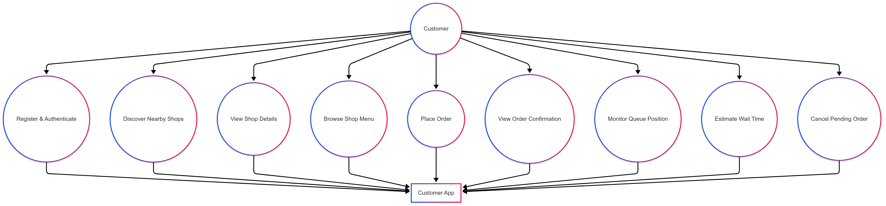
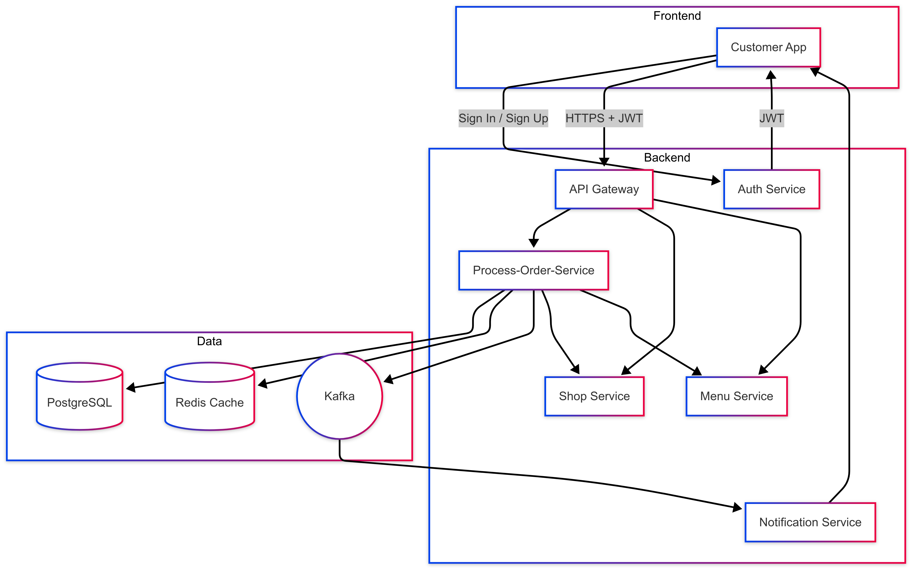
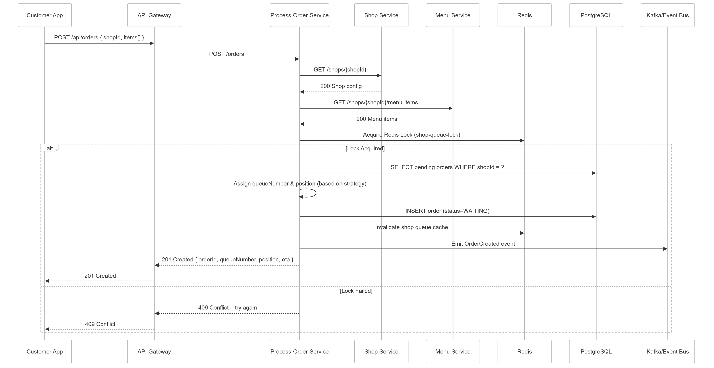
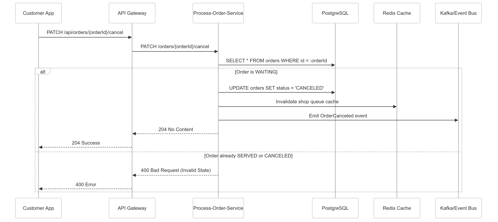

# ☕ Customer App – Solution Design (Part 1)

## 1. 📌 Overview

The Customer App enables end users to browse a coffee shop’s menu, place an order, track their position in the queue, and cancel the order if necessary. It communicates with a set of backend microservices. This document presents the technical solution design for backend integration, including APIs, architecture, standards, and testing approach.

## 2. 🧩 Use-Case Model

### 2.1 Primary Actors

| Actor                     | Description                                  |
|---------------------------|----------------------------------------------|
| **Customer**              | End-user using the Customer App              |
| **Auth Service**          | Issues & validates JWTs                      |
| **Process-Order-Service** | Owns order lifecycle & queue logic           |
| **Shop Service**          | Provides shop & queue configuration          |
| **Menu Service**          | Provides menu catalog                        |

### 2.2 Use-Case Diagram



### 2.3 Key Use Cases

| UC-ID | Title        | Main Success Scenario                                           |
|-------|--------------|-----------------------------------------------------------------|
| UC-01 | Browse Menu  | Customer requests menu; items returned.                         |
| UC-02 | Place Order  | Customer selects items → submits → receives queue number & ETA. |
| UC-03 | Track Order  | Customer checks real-time queue position                        |
| UC-04 | Cancel Order | Customer cancels a PENDING order                                |

## 3. 🏗 Conceptual Architecture


## 4. 📈 Sequence Diagrams

### 4.1 UC-02 Place Order


### 4.2 UC-04 Cancel Order


## 5. 🗃 Data Design

### 5.1 Relational Model (Simplified)

| Table       | Columns (PK ⚑)                                                                                                        | Notes                    |
|-------------|------------------------------------------------------------------------------------------------------------------------|--------------------------|
| **orders**  | `id⚑`, `shop_id`, `customer_id`, `queue_number`, `status`, `created_at`, `updated_at`                                 | Managed by Order Service |
| **items**   | `id⚑`, `order_id`, `menu_item_id`, `quantity`, `price`, `total_price`                                                 | 1:N with `orders`        |

### 5.2 JSON Schemas

```json
{
  "shopId": "123",
  "items": [
    { "menuItemId": "456", "quantity": 2 }
  ]
}
```

```json
{
  "orderId": "abc123",
  "queueNumber": 1,
  "position": 5,
  "estimatedWaitMinutes": 8
}
```

```json
{
  "orderId": "abc123",
  "shopId": "123",
  "status": "WAITING",
  "queueNumber": 1,
  "livePosition": 3,
  "estimatedWaitMinutes": 6,
  "totalPrice": 45.0,
  "items": [
    {
      "menuItemId": "456",
      "quantity": 2,
      "price": 22.5,
      "totalPrice": 45.0
    }
  ]
}
```

## 6. 🔁 Data Flow

1. Customer logs in → gets JWT
2. App retrieves menu
3. App sends order → Order Service validates → assigns queue
4. Customer polls or receives push notification
5. Cancel request updates status

## 7. 🎯 Standards
### 7.1 General Standards

| Category         | Standard                                                                 |
|------------------|--------------------------------------------------------------------------|
| **Language**     | Java 17, Spring Boot 3                                                   |
| **Architecture** | Hexagonal / Clean (framework-free core)                                 |
| **Packages**     | `com.org.order.{domain, port, adapter}`                                 |
| **DB**           | snake_case columns; singular table names                                |
| **JSON**         | camelCase field names; ISO 8601 timestamps                              |
| **API**          | RESTful; version prefix `/v1`; plural nouns                             |
| **CI/CD**        | GitHub Actions → Build, Test, Docker → K8s                              |
| **Testing**      | JUnit 5, Mockito, Testcontainers, WireMock                              |
| **Quality**      | SonarQube, 80%+ unit test coverage                                      |

### 7.2 Classes Standards
#### 🧱 Java & Application Layer

| Artifact Type         | Naming Convention         | Notes                                               |
|------------------------|---------------------------|-----------------------------------------------------|
| **Use Case Interface** | `*UseCase`                | Declares input ports for application use cases      |
| **Use Case Impl**      | `*Service`                | Implements business logic; lives in application     |
| **External Service**   | `*Client` or `*Adapter`   | Adapters for outbound services (Shop, Menu, etc.)   |
| **Inbound Controller** | `*Controller`             | Handles REST API input                              |
| **Mapper**             | `*Mapper`                 | Handles DTO ↔ Domain conversions                    |
| **Exception**          | `*Exception`              | Custom exceptions thrown in domain or app layers    |
| **Test Classes**       | `*Test`, `*IT`            | `Test` for unit tests, `IT` for integration tests   |

---

#### 🗄️ Domain & Persistence

| Artifact Type       | Naming Convention         | Notes                                        |
|----------------------|---------------------------|----------------------------------------------|
| **Entity**           | `*Entity`                 | JPA-persisted class                          |
| **Repository**       | `*Repository`             | Interfaces extending `JpaRepository`         |
| **Value Object**     | Plain name                | Immutable domain value (e.g., `OrderItem`)   |
| **Enum**             | UpperCamelCase            | e.g., `OrderStatus`, `UserRole`              |


## 8. 🔐 Security

- JWT (RS256) from Auth Service
- Role-based authorization
- TLS 1.3 + mTLS for service comms
- Rate limiting via Resilience4j
- OAuth2 planned using Auth0

## 9. 🔌 API Endpoints (v1)

### Authentication

| Method | Path                 | Auth   | Description               |
|--------|----------------------|--------|---------------------------|
| POST   | `/v1/auth/login`     | Public | Authenticate & get JWT    |
| POST   | `/v1/auth/register`  | Public | Register new user         |

### Orders

| Method | Path                                | Auth         | Description                          |
|--------|-------------------------------------|--------------|--------------------------------------|
| POST   | `/v1/orders`                         | Customer JWT | Place a new order                    |
| GET    | `/v1/orders/{orderId}`              | Customer JWT | Get order status & position          |
| PATCH  | `/v1/orders/{orderId}/cancel`       | Customer JWT | Cancel a PENDING order               |
| PATCH  | `/v1/orders/{orderId}/serve`        | Operator JWT | Mark order as SERVED                 |

### Shops & Queues

| Method | Path                                  | Auth         | Description                   |
|--------|----------------------------------------|--------------|-------------------------------|
| GET    | `/v1/shops/{shopId}/queue`            | Customer JWT | Get shop queue snapshot       |
| GET    | `/v1/shops/{shopId}`                  | Internal     | Get shop configuration        |

### Menu

| Method | Path                                              | Auth   | Description                          |
|--------|---------------------------------------------------|--------|--------------------------------------|
| GET    | `/v1/shops/{shopId}/menu`                         | Public | Get available menu items             |
| GET    | `/v1/shops/{shopId}/menu-items/{itemId}`          | Internal | Get details of a menu item          |

## ✅ 10. Testing Strategy

### 🧪 Test Levels & Tools

| Level           | Purpose                                                        | Suggested Tools                                              |
|------------------|----------------------------------------------------------------|--------------------------------------------------------------|
| **Unit**         | Validate individual methods in isolation (e.g., domain models, mappers) | JUnit 5, Mockito, AssertJ                                    |
| **Application**  | Test business logic and use cases with mocked dependencies     | JUnit 5, Mockito                                             |
| **Integration**  | Verify adapters (DB, Redis, HTTP clients) and config correctness | Spring Boot Test, Testcontainers (Postgres, Redis), WireMock |
| **API**          | Validate REST APIs against OpenAPI spec                        | Postman                                                      |
| **End-to-End** (optional) | Simulate full user journey (across services)                  | Cucumber                                                     |
| **Security**     | Ensure authorization, role checks, and attack surface coverage | Spring Security Test                                         |

---
