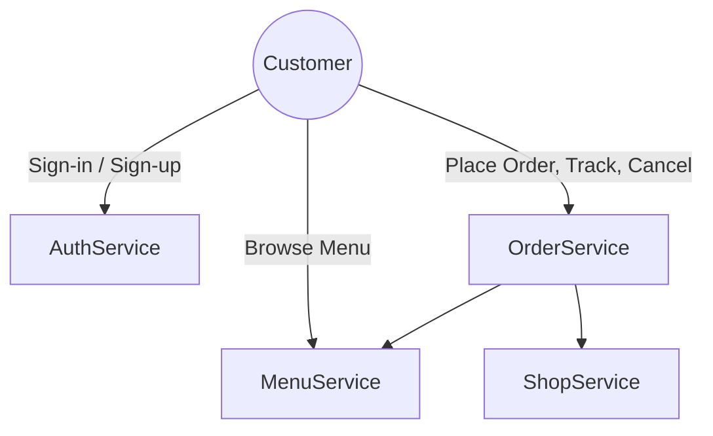
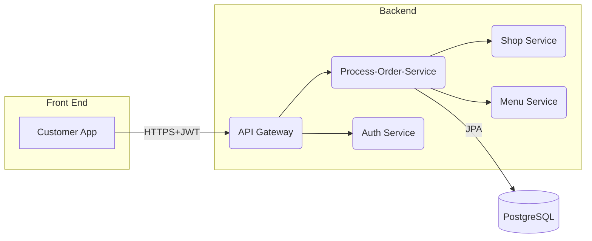
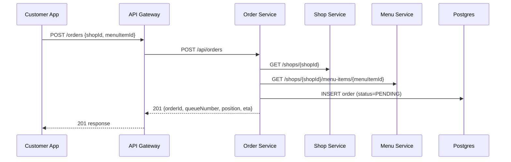
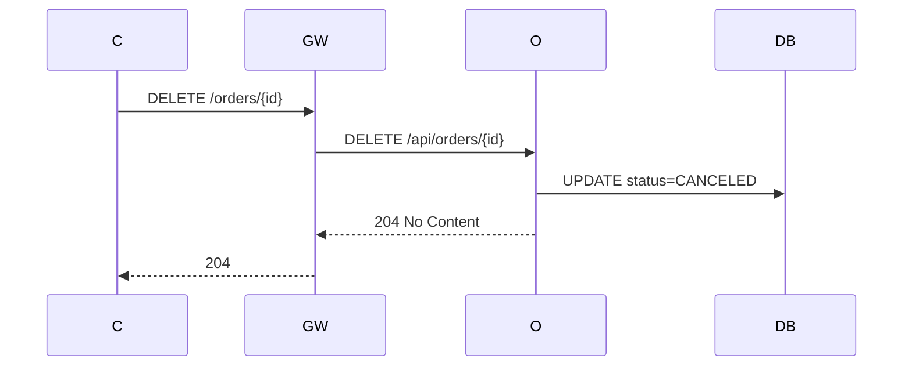

# Customer App – Solution Design (Part 1)

## 1  Overview

The Customer App enables end‑users to browse a coffee shop’s menu, place an order, track their position in the queue,
and cancel the order if necessary. It communicates with the backend microservice ecosystem. This document presents a
complete technical design for the Customer App back‑end integration, standards, and testing approach.

---

## 2  Use‑Case Model

### 2.1  Primary Actors

| Actor                     | Description                                  |
|---------------------------|----------------------------------------------|
| **Customer**              | End‑user using the mobile / web Customer App |
| **Auth Service**          | Issues & validates JWTs                      |
| **Process‑Order‑Service** | Owns order lifecycle & queue logic           |
| **Shop Service**          | Provides shop & queue configuration          |
| **Menu Service**          | Provides menu catalogue                      |

### 2.2  Use‑Case Diagram



### 2.3  Key Use Cases

| UC‑ID | Title        | Main Success Scenario                                           |
|-------|--------------|-----------------------------------------------------------------|
| UC‑01 | Browse Menu  | Customer requests menu; menu items returned.                    |
| UC‑02 | Place Order  | Customer selects items → submits → receives queue number & ETA. |
| UC‑03 | Track Order  | Customer polls/receives push updates on queue position.         |
| UC‑04 | Cancel Order | Customer cancels PENDING order; receives confirmation.          |

---

## 3  Conceptual Architecture



- All calls are HTTPS.
- JWT (RS256) is propagated via `Authorization: Bearer` header.

---

## 4  Interaction (Sequence) Diagrams

### 4.1  UC‑02  Place Order



### 4.2  UC‑04  Cancel Order



---

## 5  Data Design

### 5.1  Relational Model (simplified)

| Table      | Columns (PK ⚑)                                                                                                             | Notes                    |
|------------|----------------------------------------------------------------------------------------------------------------------------|--------------------------|
| **orders** | `id⚑`, `shop_id`, `customer_id`, `menu_item_id`, `queue_number`, `position_in_queue`, `status`, `created_at`, `updated_at` | Managed by Order Service |

### 5.2  JSON Schemas (extract)

```jsonc
// Create Order Request
{
  "shopId": "123",
  "menuItemId": "456"
}
```

```jsonc
// Create Order Response
{
  "orderId": "abc123",
  "queueNumber": 1,
  "position": 5,
  "estimatedWaitMinutes": 8
}
```

---

## 6  Data Flow

1. **Authentication** – Customer logs in → Auth Service returns JWT.
2. **Menu Retrieval** – App fetches menu (cached by gateway).
3. **Order Placement** – App sends order → Order Service validates via Shop/Menu services → stores order.
4. **Queue Tracking** – App polls `/orders/{id}` or receives push (WebSocket/FCM) events.
5. **Cancellation** – App calls DELETE; Order Service updates DB & recalculates queue.

---

## 7  C**oding, Naming & Technology S**tandards

| Category         | Standard                                                                         |
|------------------|----------------------------------------------------------------------------------|
| **Language**     | Java 17, Spring Boot 3.x                                                         |
| **Architecture** | Clean Architecture / Hexagonal (domain & use‑case layers free of framework deps) |
| **Packaging**    | `com.<org>.order.<layer>` e.g. `domain`, `application.port`, `adapters.web`      |
| **Class Naming** | `*Controller`, `*Service`, `*Repository`, `*Adapter`, `*UseCase`                 |
| **JSON**         | camelCase property names; ISO‑8601 timestamps                                    |
| **DB**           | snake\_case column names; singular table names                                   |
| **API**          | RESTful, nouns, plural resources; version prefix `/v1`                           |
| **Docs**         | OpenAPI 3 via springdoc; ADRs in repo                                            |
| **CI/CD**        | GitHub Actions – build, test, scan, docker‑build, deploy to k8s                  |
| **Code Quality** | SonarQube, 80% unit coverage minimum                                             |
| **Security**     | OWASP Top‑10, Snyk dependency scans                                              |

---

## 8  Security Solution

- **Authentication**: OAuth2 Resource Server; JWT (RS256) signed by Auth Service; JWKS endpoint cached.
- **Authorization**: Role‑based – `ROLE_CUSTOMER`, `ROLE_OPERATOR`; method‑level checks with `@PreAuthorize`.
- **Transport**: TLS 1.3 everywhere; mTLS for internal service‑to‑service calls.
- **Data Protection**: PII encrypted at rest (Postgres TDE or pgcrypto). Passwords hashed with Argon2 in Auth Service.
- **Input Validation & Rate Limiting**: Hibernate Validator; Resilience4j RateLimiter per user.
- **Secrets Management**: Kubernetes Secrets + sealed‑secrets; rotated via Vault.
- **Monitoring & Alerts**: Prometheus metrics + Grafana dashboards; audit logs shipped to ELK.

---

## 9  API Contract (v1)

| Method & Path                                       | Auth         | Description                 |
|-----------------------------------------------------|--------------|-----------------------------|
| **POST** `/v1/orders`                               | Customer JWT | Place new order             |
| **GET** `/v1/orders/{orderId}`                      | Customer JWT | Get status & queue position |
| **DELETE** `/v1/orders/{orderId}`                   | Customer JWT | Cancel pending order        |
| **GET** `/v1/shops/{shopId}/menu`                   | Public       | Retrieve menu items         |
| **GET** `/v1/shops/{shopId}/queue`                  | Customer JWT | Snapshot of queues          |
| *(Operator)* **PATCH** `/v1/orders/{orderId}/serve` | Operator JWT | Mark order served           |

*All endpoints return standard HTTP status codes (200/201/204/400/401/403/404/409/500) and RFC 7807 Problem Details for
errors.*

---

## 10  Testing Strategy (Headless)

| Level           | Tooling                                         | Approach                                                                  |
|-----------------|-------------------------------------------------|---------------------------------------------------------------------------|
| **Unit**        | JUnit 5, Mockito                                | Validate domain & use‑case logic in isolation                             |
| **Contract**    | Spring Cloud Contract                           | Stub producer & consumer tests                                            |
| **Integration** | Testcontainers (Postgres), WireMock (Shop/Menu) | Spin up containerised deps, test REST endpoints via MockMVC/WebTestClient |
| **API**         | Postman / Newman or REST‑Assured                | Collection covering happy & edge cases; run in CI                         |
| **E2E**         | Karate / Cucumber (optional)                    | Behavioural tests from customer perspective                               |
| **Security**    | OWASP ZAP automated scan in pipeline            |                                                                           |

> The API can be fully exercised via Postman or cURL; Swagger UI served at `/swagger-ui.html` lets QA explore without a
> front‑end. Mock data for Shop & Menu services is seeded via Testcontainers on startup for local testing.

---

## 11  Glossary

| Term     | Meaning                                  |
|----------|------------------------------------------|
| **ETA**  | Estimated Time of Arrival / wait minutes |
| **JWT**  | JSON Web Token                           |
| **mTLS** | Mutual TLS                               |
| **ADR**  | Architecture Decision Record             |

